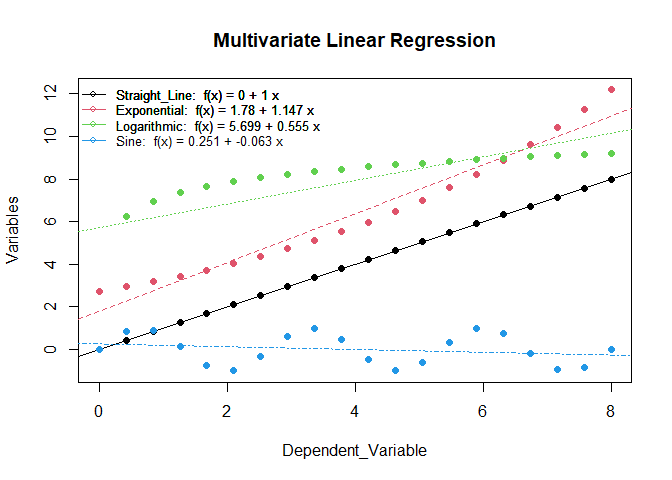
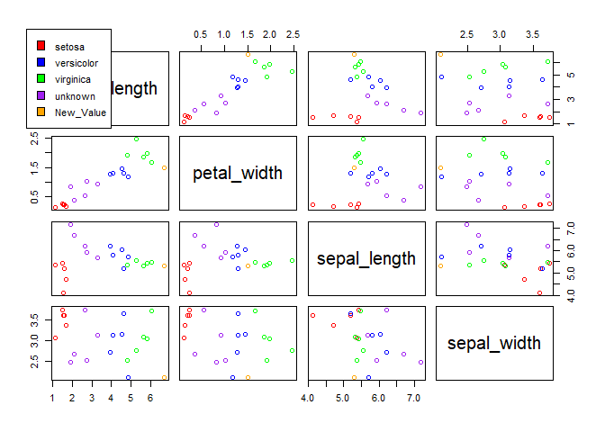

# LearnSL

The goal of LearnSL is to provide a set of functions to perform
supervised classification along with comprehensive explanations of the
algorithms, their pros and cons, and their applications.

## Installation

You can install the released version of LearnSL from
[CRAN](https://cran.r-project.org/) with:

``` r
install.packages("LearnSL")
```

You can install the development version of LearnSL from
[GitHub](https://github.com/) with:

``` r
# install.packages("devtools")
devtools::install_github("ComiSeng/LearnSL")
```

## Example

This is a basic example which shows you how to classify a dataset:

``` r
library(LearnSL)
multivariate_linear_regression(db1rl)
```

<!-- -->

This is yet another example of an implemented classification algorithm,
showing the step by step process:

``` r
library(LearnSL)
knn(db_flowers,"ClassLabel", c(6.7, 1.5, 5.3, 2.1), "Euclidean", 2, details = TRUE, waiting = FALSE)
```

    ## 

    ## EXPLANATION

    ## ________________________________________________________________________________
    ## ________________________________________________________________________________

    ## 

    ## Step 1:

    ##     - Calculate the chosen d_method from the value we want to classify to every

    ##     other one.

    ## Step 2:

    ##     - Select the k closest neighbors and get their classes.

    ## Step 3:

    ##     - Create a scatterplot matrix with the provided values for visualization pur

    ##     pose

    ## Step 4:

    ##     - Select the most repeated class among the k closest neighbors classes.

    ## ________________________________________________________________________________
    ## ________________________________________________________________________________

    ## 

    ## Step 1:

    ## 

    ## Distance from p1 to every other p.

    ##  [1] 5.666469 5.394510 5.586155 5.812633 5.471676 2.978727 2.588349 1.907590
    ##  [9] 2.518859 2.884434 1.368425 1.480560 1.977996 1.869735 1.741970 3.633439
    ## [17] 4.079999 4.965582 4.571177 5.201494

    ## ________________________________________________________________________________

    ## 

    ## Step 2:

    ## 

    ## These are the first k values classes:

    ## [1] "virginica" "virginica"

    ## ________________________________________________________________________________

    ## 

    ## Step 3:

    ## 

    ## Plot values.

    ## ________________________________________________________________________________

    ## 

    ## Step 4:

    ## 

    ## The most represented class among the k closes neighbors is virginica

    ## therefore, that is the new value's predicted class.

<!-- -->

    ## [1] "virginica"
